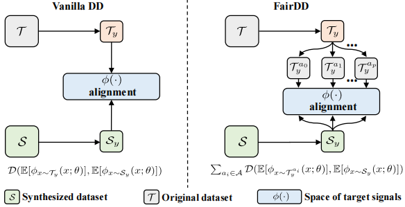

# FairDD: Fair Dataset Distillation


### Method
<p align="center"></p>
<center>Figure 1: The overview of FairDD. FairDD first groups target signals of $\mathcal{T}$ and then proposes to align $\mathcal{S}$ (random initialization) with respective group centers. With this synchronized matching, $\mathcal{S}$ is simultaneously pulled by all group centers in a batch. This prevents the condensed dataset $\mathcal{S}$ from being biased towards the majority group, allowing it to better cover the distribution of $\mathcal{T}$. </center><br>

### Setup
install packages in the requirements.

### Dataset preparation
```
Use the following URL to download the dataset and save the dataset to the ./data folder.
CelebA: http://mmlab.ie.cuhk.edu.hk/projects/CelebA.html
UTKface: https://susanqq.github.io/UTKFace/
BFFHQ: https://drive.google.com/drive/folders/1JEOqxrhU_IhkdcRohdbuEtFETUxfNmNT
```

###  Main experiments
```
bash scripts/main_DC.sh
bash scripts/main_DM.sh
```

